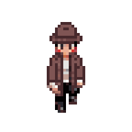
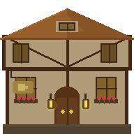
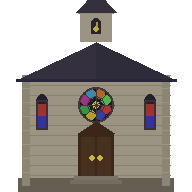
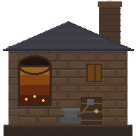
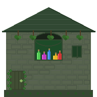
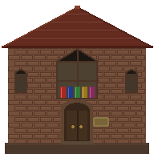

<p align="center">
  
</p>

<h1 align="center">Quantum Blood</h1>

<p align="center">
  <em>A pixel-art murder mystery where every NPC thinks for themselves.</em>
</p>

<p align="center">
  
  
  
  
</p>

---

## The Premise

A murder has shaken a quiet medieval village. As the detective, you have **3 days** to interrogate townsfolk, search crime scenes, gather evidence, and identify the killer — before they strike again.

The twist? Every NPC is powered by a **local LLM**. They have unique personalities, memories, relationships, and alibis. The villain will lie. Innocents might misremember. Nobody gives you the full picture.

## Features

**LLM-Driven NPCs** — Each character has a persistent personality, emotional state, and memory. Conversations are generated in real-time via Ollama, so no two playthroughs are alike.

**Day/Night Cycle** — Investigate during the day; a villager dies each night. The clock is ticking.

**Evidence System** — Search 7 explorable building interiors for physical clues. Evidence corroborates or contradicts what NPCs tell you.

**Dynamic Relationships** — NPCs have rivalries, friendships, grudges, and secrets. The villain always has motive.

**Suspicion Tracker** — The game builds a clue journal from your conversations and discoveries, helping you piece together the case.

**Pixel-Art World** — Hand-crafted tile map with unique building sprites, animated characters, and atmospheric lighting.

<p align="center">
  
  
  
  
  
  
  
</p>
<p align="center"><sub>Tavern &bull; Church &bull; Blacksmith &bull; Apothecary &bull; General Store &bull; Town Hall &bull; Library</sub></p>

## Getting Started

### Prerequisites

- Python 3.10+
- [Ollama](https://ollama.com) running locally with a model pulled

### Install & Run

```bash
# Clone the repo
git clone https://github.com/yourusername/hackbeta2026.git
cd hackbeta2026

# Install dependencies
pip install pygame-ce ollama numpy Pillow

# Pull an LLM model
ollama pull llama3.1

# Play
python main.py
```

> **Tip:** Set `OLLAMA_HOST` to point at a remote machine if you want to offload LLM inference:
> ```bash
> OLLAMA_HOST=http://192.168.1.50:11434 python main.py
> ```

## Controls

| Key | Action |
|-----|--------|
| `WASD` / `Arrow Keys` | Move |
| `E` / `Enter` | Talk to NPC / Interact |
| `Tab` | Accuse a suspect |
| `J` | Open clue tracker |
| `L` | Evidence log |
| `B` | Character journal |
| `Esc` | Exit building / Close menu |
| `F11` | Toggle fullscreen |

## How to Play

1. **Explore the village** — Walk between 7 buildings and talk to the townsfolk
2. **Interrogate NPCs** — Ask questions, press for details, note contradictions
3. **Search interiors** — Enter buildings and examine objects for physical evidence
4. **Cross-reference** — Use your journal (`B`) and clue tracker (`J`) to connect the dots
5. **Make your accusation** — Press `Tab` when you're confident. You get 3 wrong guesses before it's game over

## Architecture

```
main.py              — Game loop, rendering, state machine, LLM integration
generate_buildings.py — Procedural pixel-art building sprite generator
data (1).csv         — NPC character data (names, traits, backstories)
assets/
  buildings/         — 192x192 building sprites (7 unique buildings)
  characters/        — Detective + NPC sprite sheets with 8-dir walk cycles
  videos/            — Menu background animation frames
sounds/              — Music tracks + SFX (door, speech, evidence, night)
```

## Tech Stack

| Layer | Tech |
|-------|------|
| Game Engine | Pygame CE |
| AI Backend | Ollama (local LLM inference) |
| Default Model | Llama 3.1 (falls back to Qwen 3.5 0.8B) |
| Audio | Procedurally generated footsteps + composed soundtrack |
| Sprites | Pixel art with 8-directional walk animations |

## Team

Built at **HackBeta 2026**.

---

<p align="center">
  
  <br>
  <em>The truth is out there. Go find it.</em>
</p>
